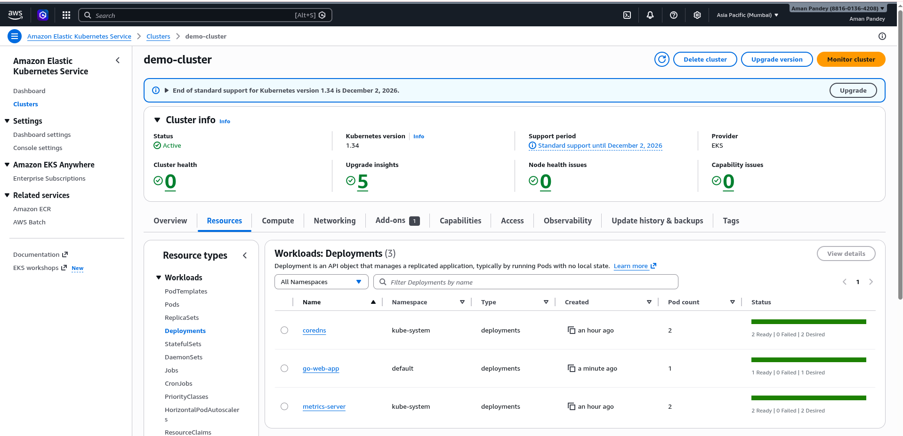

## End-to-End DevOps Project – Golang Web Application

This project demonstrates a complete End-to-End DevOps implementation for a Golang web application using modern cloud-native tools and GitOps practices.

The application is containerized, deployed to Kubernetes, and automatically updated through a CI/CD pipeline.

---

## Architecture Overview

Developer pushes code → CI pipeline builds and pushes Docker image → Helm chart updates image tag → ArgoCD detects change → Kubernetes cluster deploys new version.

---

## Kubernetes Cluster

Below is the Amazon EKS cluster running the application.

---

## How to Run Locally

1. Clone the repository: `git clone https://github.com/yourusername/go-devops-project.git`.

2. Navigate to project directory: `cd go-devops-project`.

3. Run the application: `go run main.go`.

Application will be available at: `http://localhost:8080`.

---

## Connect with Me

- My [Links for Socials](https://linktr.ee/Aman.Pandey).

